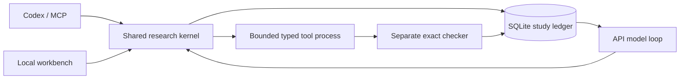

# Research Agent runtime

The runtime supplies persistence, typed execution, bounded autonomy and evidence retrieval to a
user-selected model. It does not supply general mathematical intelligence or guarantee discoveries.
Codex-hosted and API-driven use share `research_agent.Study`; neither can set a proof verdict merely
by submitting a final report.

## Install and choose an entry

From a checkout, using Python 3.10 or later:

```text
python -m pip install -e ".[agent,math]"
rigorous-research agent init research-studies expansion --objective "Derive and verify the expansion of (x+1)^2."
rigorous-research agent context research-studies/expansion
```

The `agent` extra installs JSON Schema validation and the official Python MCP SDK. SymPy remains an
optional `math` extra. The old workspace, case and standard-library integer tools remain available.

**Codex-hosted:** give Codex this repository's skill and ask it to use the Agent workflow. Start with
`agent context`, save one JSON proposal, then use:

```text
rigorous-research agent submit research-studies/expansion proposal.json --revision 0
rigorous-research agent inspect research-studies/expansion 1
```

Refresh the revision after every accepted action or data import. `context` carries the full action
schema. A minimal proposal is:

```json
{
  "action": {"tool": "identity", "arguments": {"lhs": "(x+1)**2", "rhs": "x**2+2*x+1", "symbols": ["x"]}},
  "rationale": "Check the polynomial expansion over rational coefficients.",
  "falsifier": "A nonzero difference invalidates this proof route.",
  "evidence": []
}
```

No separate model API key is required when Codex supplies the reasoning. The project cannot start
an unattended Codex conversation itself; unattended operation uses the API runner below.

**MCP / plugin:** `rigorous-research agent mcp --root research-studies` serves stdio MCP. A client
can launch that command and use `research_create`, `research_list`, `research_context`,
`research_submit`, `research_asset`, `research_inspect`, `research_pause`, and `research_export`.
The server restricts study IDs to its configured root. The submission schema returned by context
is authoritative and validated again by the kernel.

Build the distributable Codex and generic Agent Plugin bundle:

```text
python scripts/build_plugin.py --output build/codex/rigorous-research
```

It includes `.codex-plugin/plugin.json`, `.mcp.json`, and a thin skill plus supporting tools.
Install the matching Python package before connecting it. The default MCP command must be on PATH;
configure an absolute executable path when needed. Set `RESEARCH_AGENT_ROOT` in the MCP server's
environment to an absolute writable directory. Building a bundle does not install or activate it
in Codex, and does not change a user's marketplace or global settings.

**Standalone API:** set `RESEARCH_AI_MODEL` and `RESEARCH_AI_API_KEY` in your shell or secret manager,
then run:

```text
rigorous-research agent run research-studies/expansion --steps 12 --seconds 600
```

The default provider is OpenAI Responses at `https://api.openai.com/v1`. Override `--provider`,
`--endpoint`, `--model`, and `--api-key-env` as needed. Supported alternatives are
`openai-compatible` (Chat Completions JSON mode) and `ollama` (schema format; no key required).
For Ollama, explicitly use `--endpoint http://127.0.0.1:11434` and your installed model ID.
No model substitution or automatic transport retry occurs. Responses uses a structured proposal
envelope which is then validated locally and dispatched to the allowlisted tools.

API mode sends the original objective, recent actions/results, asset labels and recorded events to
the selected endpoint. Numeric assets stay local until their derived outputs enter context. Avoid
putting secrets in research text. Keys are read from the environment and not stored in the ledger.
Provider response hashes and selected model IDs are retained; call counts are not a billing estimate.

**Local workbench:**

```text
rigorous-research agent serve --root research-studies
```

Open `http://127.0.0.1:8765`. Create/select studies, inspect recent actions, import numeric JSON data,
pause/resume and export records. Starting the server with `--model` (or `RESEARCH_AI_MODEL`) enables
the background API button, bounded to 12 steps / 600 seconds per click. Without a model, Codex or
the CLI supplies actions. The server is loopback-only and checks Host, Origin and a session token;
it is not intended as a multi-user internet service. Shutting down the process stops its workers;
use the CLI under your own process supervisor for unattended operation.

## Shared kernel and state



Each study gets a legacy `workspace.json` and `case.json`, plus `agent.sqlite3`. SQLite records the
immutable original objective, proposals, actions, numeric assets, model events and results. Actions
are reserved before execution. A process lock prevents concurrent controllers; transactions stay
short and no database transaction waits on a model or tool. Process death releases the lock. On the
next controller operation, unfinished actions become `INTERRUPTED`, not successful.

| Field | Meaning |
|---|---|
| Action `execution` | Tool succeeded, failed, timed out or was interrupted |
| Result `status` | Exact checked scope, diagnostic calculation, candidate metadata or unverified draft |
| Study `execution=DELIVERED` | The model wrote a final report |
| `machine_contract_status=MET` | An independently checked exact result matches a user-declared tool/arguments/status contract |
| `objective_status=UNRESOLVED` | The original research goal has not passed case acceptance review |
| `translation_status=REQUIRES_REVIEW` | The relation between prose and checked expression remains an explicit obligation |

There is intentionally no model-callable operation that declares the original objective solved.
An optional `agent init --contract contract.json` contains exactly `tool`, `arguments`, and `status`
(`ESTABLISHED` or `REFUTED`) for identity, counterexample, bound or Egyptian-fraction operations. Exact matching satisfies
that machine contract only; it does not establish relevance, novelty, or an arbitrary prose claim.

The agent ledger does **not** silently update the legacy case verdicts or proof graph. Export and
inspect the evidence, then use the existing [proof assurance workflow](proof-assurance.md) to register
the exact supporting artifact and resolve translation/domain obligations. Real human review must be
identified honestly. The legacy case/release gates remain authoritative for published conclusions.

## Tools and scope

| Tool | Accepted task | Assurance |
|---|---|---|
| `identity` | Rational polynomial/identity expressions | Independent certificate recheck; original domain restrictions retained |
| `counterexample` | Bounded exact rational grid, at most 1,000 points | A witness may refute the recorded identity; no witness is inconclusive |
| `bound` | One-variable polynomial inequality on a rational interval | Independent Bernstein certificate recheck |
| `egyptian` | Finite three-unit-fraction search | Exact witnesses; missing inputs remain inconclusive |
| `egyptian_window` | One input, at most 64 first denominators | Complete divisor obstructions or witnesses; refutation concerns only the window |
| `egyptian_scan` | At most 256 inputs in a progression, width at most 16 | Shared work budget; a refuted window defeats only the finite short-window hypothesis |
| `egyptian_family` | Integer coefficient arrays for n(t), x(t), y(t), z(t), degree at most 12 | Independently checked identity, integrality and sufficient positivity/ordering proof for every integer t>=0 |
| `mean` | Registered numeric array | IID, HAC and block-bootstrap diagnostics; applicability unverified |
| `coverage` | Seeded AR(1) Gaussian or Student-t3 simulation | Finite simulation diagnostics, not a coverage theorem |
| `multiplicity` | Registered p-value array | Holm/BH calculations; p-value validity and dependence assumptions unverified |
| `literature` | Opt-in Crossref/arXiv/OpenAlex metadata retrieval | Candidate sources; inspect primary papers before citing a theorem |
| `note` | Lemma, proof draft, assumptions, method critique or follow-up input | Unverified text, with references to earlier successful action IDs |
| `recall` | Earlier non-recall action ID | Retrieves recorded evidence without upgrading its status |
| `finish` / `need_input` | Current report or concrete missing input | Does not close a theorem or original objective |

Import a JSON numeric array with `agent asset STUDY values.json --label "data provenance"` or the MCP
asset tool. Assets are bound by canonical content hashes; no model-selected arbitrary paths or shell
commands are executed. Subprocesses have wall timeouts and bounded accepted output. They are **not**
an OS security sandbox or a hard memory quota. Use an isolated environment for hostile workloads.
General Lean theorem search, arbitrary Python/R experiments, causal identification automation and
full-paper verification are not implemented in this runner; existing project tools remain usable
outside it. Unsupported proof tasks should produce explicit open obligations, not fabricated checks.

See [integer research semantics](integer-search.md#native-agent-research-tools) for coefficient order,
quantifiers and complete divisor enumeration. A constant n(t) certifies only one input; a nonconstant
family does not certify every integer. An unsupported coefficient-positivity argument remains inconclusive.

## Budgets, pause and continuation

Each API invocation has a step/model-call budget, total wall budget and per-tool deadline. Producer
and independent checker share one tool deadline. Model requests also run in a bounded process
(at most 120 seconds). Three consecutive execution failures or rejected proposals stop by default;
successful duplicate actions are rejected and their feedback is visible in the next context.
Distinct inconclusive attempts may continue until the explicit budget. Historical model calls are
recorded across invocations. A custom Python `propose(context, timeout)` callback must respect its
deadline; the built-in API callback enforces it with a subprocess.

`agent pause STUDY` prevents the next tool from starting. An already running bounded action may
finish and be recorded. `agent resume STUDY` clears the pause flag; invoke `agent run` again to start
a stopped loop. After `need_input` or `finish`, submit a `note` containing the follow-up before rerunning.
This preserves the original objective and report while reopening execution. Shutdown/crash recovery
never replays an expensive interrupted action automatically. Review it and choose the next route.

Context includes 20 recent actions, bounded result previews and 10 recent events. Inspect complete or
older actions by ID. Exports preserve all rows and content hashes. These are local reproducibility
records, not cryptographic protection against an attacker who controls the database and code.

`research_memory` also exposes the local workspace tasks, claims, assumptions and proof obligations,
with source-file hashes. Lists are capped at 16 entries and each document preview at 16,000 characters;
omission counts and truncation are explicit. Malformed/oversized files return a context error. These
records are untrusted context, not instructions or validated acceptance decisions, and cannot change
`objective_status`. Inspect larger proof graphs with the legacy case tools.

## Verification and evaluation

[Offline examples](../examples/agent-research/README.md) run real mathematical checking and statistical
simulation with explicitly synthetic controllers, including feedback-driven correction. The tests
also exercise a real local HTTP model protocol fixture, real MCP stdio initialization/tool calls,
pause races, stale context, duplicate attempts, tampered evidence, timeouts and false completion.
These establish runtime behavior, not external model capability or novel scientific output.

To assess a chosen model, keep the model version, question set, tools and budget fixed; compare direct
model use with the runtime. Score independently checked target results, incorrect completion claims,
unresolved goals, cost and reproducibility. Do not count report delivery or passing software tests as
research success. Live provider compatibility and scientific gain require those separate trials.

OpenAI interface reference: [Structured Outputs](https://developers.openai.com/api/docs/guides/structured-outputs).
